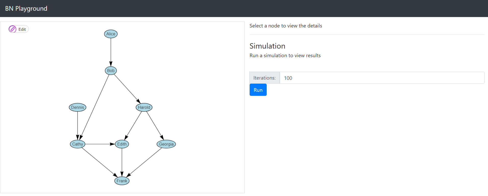
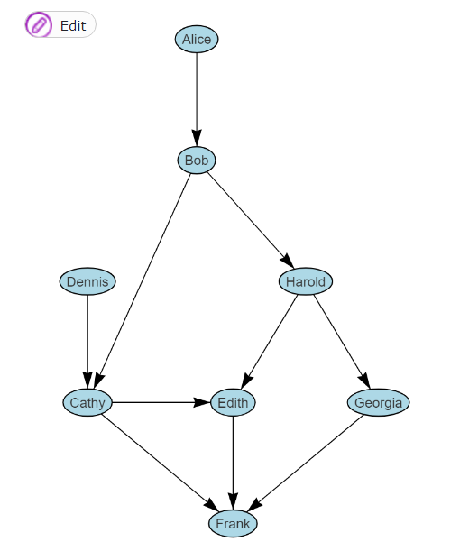
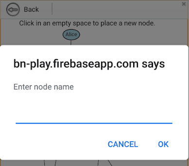
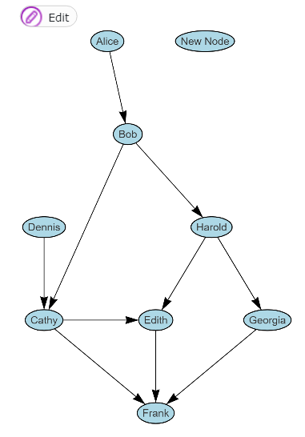
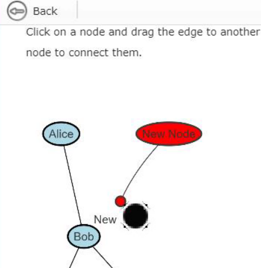
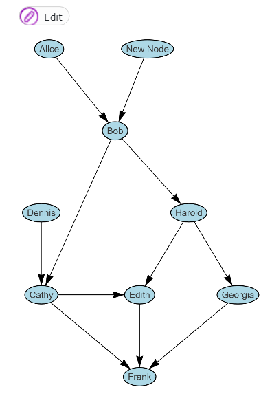
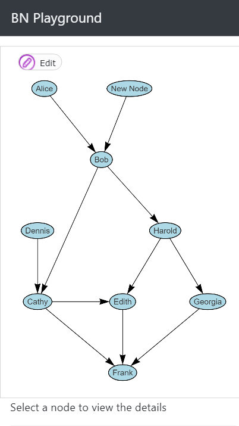
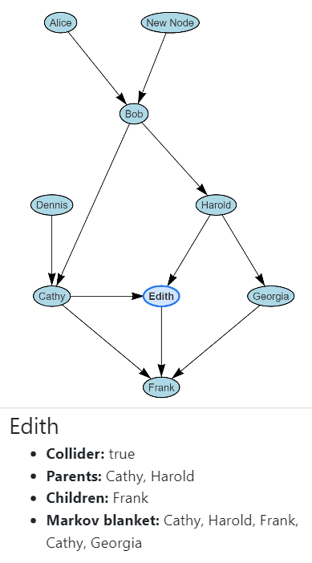

<h1>bn-play: A tool for learning Bayesian Networks through manipulation and simulation</h1>
<!-- Used h1 here so the line would be left out of the TOC -->

>Josh Gribbon

[TOC]

<!--
TODO:
* [_] Add some research for education and interface stuff
* [/] Finish outline
* [_] Put name somewhere
* [/] Fill in sections
* [_] Format references
* [_] Format document as two-column pdf
    * [_] Review and update formatting in general
* [_] Check on removing the data structures and algorithms part
* [_] Submit to canvas
-->

## 0. Abstract

`bn-play` is a tool for learning about Bayesian Networks through visualization and interface. The main focus of the project is an intuitive and explanatory interface. Modern web app tools are used to create an interface that is linked to the underlying structures, simplifying the design, helping ensure that the user is seeing data in the right context across components, aiding in layout, and assisting with browser compatability. The simulation component is designed to be simple, robust, and expandable. The resulting project achieved all the critical features listed in the proposal as well as some stretch goals, while also being poised for future development.

## 1. Introduction

The main goal of this project is to create an accessible tool for improving our knowledge and understanding of Bayesian Networks. This was the driving motivation behind the design decisions and implementation details. Deployment as a web app increases the potential reach to anyone with a phone, laptop, or tablet, and even with limited network connectivity. Further, it allows for simple and rapid interface development with modern tooling, resulting in flexible and optimized deployments.

## 2. Interface Design

As far as a user is concerned, the interface is the product. We often see products lose to a competitor that offers the same or less functionality, but with a better interface, such as Apple with the iPhone. A sizable amount of effort went into developing the interface to create a unified experience. This is accomplished using complex strategies like data binding across components to ensure that changes made in one location are reflected across the application, simple strategies like the presence of tooltips to explain the meaning behind different views, and stuff in between such as default values that prompt user interaction.

The section on *Technologies Used* discussing how various tools aid in these implementations.

Reactive for web/mobile, offline after initial download, SPA so no need to reload page, simple distribution through static files, easy to wrap in electron as a desktop app in the future, modern web design for simple future development.

### Component Overview
>
>Fig 2.01

Figure 2.01 shows the desktop layout of the application, the mobile version will be used for all other images because the compact view will be better in this format. Essentially the two columns, one with the network and the other with the text, become a single column with the network on top.

#### Network Viewer

Figure 2.02 shows the Network Viewer, which displays the bayesian network to the user, and provides an interface to modify the structure. The inidividual nodes are displayed as names inside ovals, with arrows connecting each one, following the standard format for visualizing Bayesian Networks.

>
>Fig 2.02

Show selected node

##### Modifying Nodes and Edges

The "Edit" button in figure 2.02 can be clicked to reveal the options in figure 2.03

>
>Figure 2.03

If the user clicks "Add Node", they are prompted to choose a location for the new node, and enter a name for the node, as shown in figure 2.04.

>
>Figure 2.04

>
>
>
>
>>

Show the add node and add edge view, then for selected nodes and edges to delete

This sidesteps the concern of how to build the BN from your data, leaving that problem to the user

#### Selected Node Details

#### Conditional Probability Table

#### Simulator

### Technologies Used

Focus on how it's used to improve the interface

#### Reactive data system and data binding

#### Visualization

vis.js and chart.js

#### Deployment

Firebase - simple to use, free for 10GB/month
* 717 KB total = 0.000717GB = 13947 initial downloads
* ~900B after caching = ~12M redownloads
> write out the equation for how many users it can support

After initial download:
* Offline
* All storage is client-side
* No network connection needed
 
## Desired Use and Impact

### Learning

### Simple simulations

### Additional functionality

## Future Work

Electron so you can be fully offline after the initial download
> Fill in from the todo in the readme

## Important Data Structures and Algorithms

> Not sure about this section, maybe check with her and have two versions ready

### `BayesianNetwork`

#### `BNode`
IDs used internally but names for display, allowing two nodes with the same name without issues

#### `BEdge`

#### `runSimulation()`

> Fill in psuedo-code

## References

## Closing Notes

Report format inspiration mainly taken from https://www.usenix.org/legacy/event/sec08/tech/full_papers/adida/adida.pdf, as it is a research paper discussing a project where both the interface and features of the implementation would be of concern