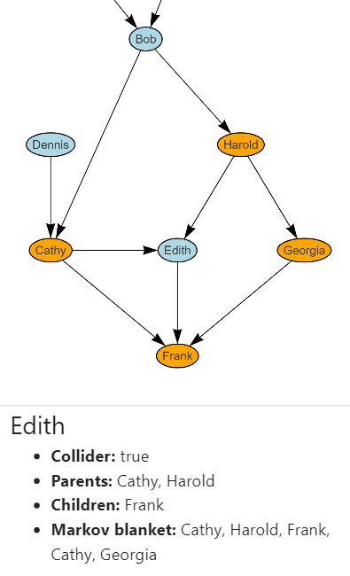
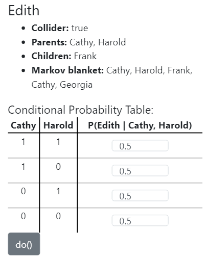
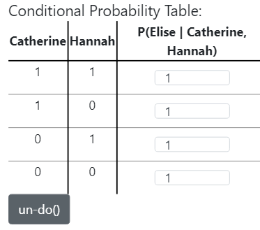
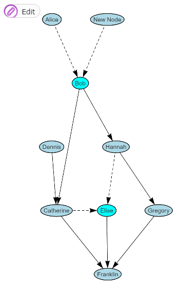
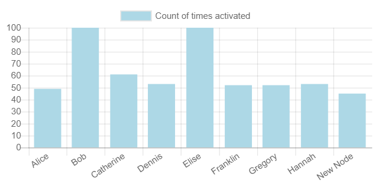
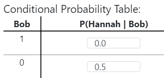
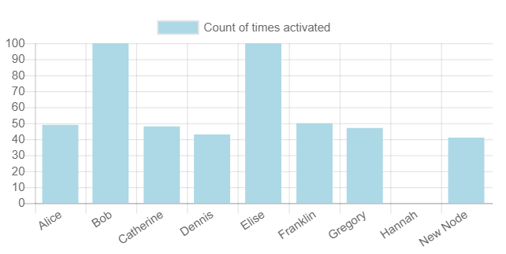
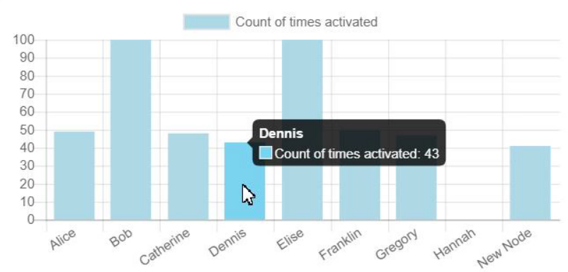

<h1>bn-play: A tool for learning Bayesian Networks through manipulation and simulation</h1>
<!-- Used h1 here so the line would be left out of the TOC -->

>Josh Gribbon

[TOC]

<!--
TODO:
* [x] Finish outline
* [_] Put name somewhere
* [/] Fill in sections
* [_] Format references
* [_] Format document as two-column pdf
    * [_] Review and update formatting in general
* [_] Proofread
* [_] Check on removing the data structures and algorithms part
* [_] Submit to canvas
-->

## 0. Abstract

`bn-play` is a tool for learning about Bayesian Networks through visualization and interface. The main focus of the project is an intuitive and explanatory interface. Modern web app tools are used to create an interface that is linked to the underlying structures, simplifying the design, helping ensure that the user is seeing data in the right context across components, aiding in layout, and assisting with browser compatability. The simulation component is designed to be simple, robust, and expandable. The resulting project achieved all the critical features listed in the proposal as well as some stretch goals, while also being poised for future development.

## 1. Introduction

The main goal of this project is to create an accessible tool for basic knowledge and understanding of Bayesian Networks. This was the driving motivation behind the design decisions and implementation details. Deployment as a web app increases the potential reach to anyone with a phone, laptop, or tablet, and even with limited network connectivity. Further, it allows for simple and rapid interface development with modern tooling, resulting in flexible and optimized deployments.

## 2. Interface Design

As far as a user is concerned, the interface is the product. We often see products lose to a competitor that offers the same or less functionality, but with a better interface. A sizable amount of effort went into developing the interface to create a unified experience. This is accomplished using complex strategies like data binding across components to ensure that changes made in one location are reflected across the application, simple strategies like the presence of tooltips to explain the meaning behind different views, and stuff in between such as default values that prompt user interaction.

The section on *Technologies Used* discussing how various tools aid in these implementations.

### Component Overview

This overview of the components will also serve as a walkthrough showing a basic workflow adding a node, connecting it with an edge, viewing node details, modifying the conditional probability values for the run, and running a simulation.

The overall app layout, shown in figure 2.01 in the desktop layout, consists of a navigation bar at the top with the name of the project, and two columns. On the left we see the Network Viewer displaying the network visually, and on the right we have the Selected Node Details, and the Simulation Controls. In the mobile version these two columns become one, with the node details appearing under the network. The mobile view will be used for all future images because the aspect ratio is more appropriate for this report.

>
>Fig 2.01

#### Network Viewer

The Network Viewer, shown in figure 2.02, displays the Bayesian Network to the user, and provides an interface to modify the structure. The inidividual nodes are displayed as names inside ovals, with arrows connecting each one, following the standard format for visualizing Bayesian Networks.

>
>Fig 2.02 - The network view component

##### Modifying Nodes and Edges

The Network Viewer allows the user to modify the network by adding and removing nodes and edges, while seeing the resulting structure as they go. It is worth noting that this avoid the issue of creating the initial network structure, and leaves that to the user to solve.

The "Edit" button in figure 2.02 can be clicked to reveal the options in figure 2.03, with an additional option to delete the selected item if a node or edge is selected.
If the user clicks "Add Node", they are prompted to choose a location for the new node, and enter a name for the node, as shown in figure 2.04. Figure 2.05 shows the network with the new node added. After adding a node there are initially no edges connected to it, figure 2.06 shows how an edge is added, by clicking and dragging from the source node to the target. Figure 2.07 shows the result of adding a new node and connecting it to an existing node in the graph.

>
>Figure 2.03 - Buttons to add nodes and edges

>
>Figure 2.04 - The prompt for a node name

>
> Figure 2.05 - The new node added to the network, initially with no edges

>
> Figure 2.06 - The process to add a new edge, after clicking "New Node" the user drags the endpoint to the node they want the edge to end at. The black circle here is the users finger on the screen

>
> Figure 2.07 - The network with the new edge added

#### Selected Node Details

The Selected Node Details component provides contextual info to the user for any node they click on in the graph. Initially, no node is selected, so text is displayed to the user prompting them to select a node to view this info, shown at the bottom of figure 2.08. Figure 2.09 shows the results after selecting a node, displaying if the node is a collider, what the parent and child nodes are, and the nodes that consistute the Markov Blanket. Hovering the cursor over any of these items will highlight the appropriate nodes on the Network Viewer, as shown in figure 2.10 with the Markov Blanket for Edith.

>
> Figure 2.08 - Selected node details, initially showing a prompt to select a node, when no node is selected

>
> Figure 2.09 - Node relations list, showing if it is a collider as well as the nodes that make up the parents, children, and Markov Blanket

>
> Figure 2.10 - Hovering on one of the relation lists will highlight those nodes in the network view component, in this case the cursor is hovering on the Markov Blanket list item

##### Conditional Probability Table

The Selected Node Details component includes the conditional probability table(CPT) for the node. Initially and after the node parents change, all values are 0.5, given the node equaly likliehood of being activated in response to any combination of parent values, shown in figure 2.11. The node names are used in the table to show what nodes and combinations of states can happen, and how the node can have different probabilities for each. These can all be edited to any value between 0 and 1 inclusive, shown in figure 2.12.

Beneath the CPT is a `do()` button for the node, which has several effects. First, all the values of the CPT are changed to 1, so the node is activated regardless of the parent states. Second, the `do()` button text changes to `un-do()` and will then reverse the action. These first two changes are shown in figure 2.13. Lastly, the Network Viewer changes to highlight the nodes that have a `do()` action activated on them, and the parent edges become dashed to show that they have no effect anymore, shown in figure 2.14 for Bob and Elise.

>
> Figure 2.11 - The conditional probability table(CPT), shown below the list of node relations

>
> Figure 2.12 - The CPT with edited values

>
> Figure 2.13 - The CPT after pressing the `do()` button, with the `un-do()` button to revert the values

>
> Figure 2.14 - The network with `do()` executed on Bob and Elise, with altered node colors, and dashed edges to show the lack of effect

#### Simulator

The simulator component allows a user to run anywhere between one and ten thousand simulations, and then see a histogram showing the results. Simulations in the higher range can take a couple seconds, but results are near-instant for values under one thousand.

Much like the selected node details view, initially the user sees text letting them know they should run a simulation to see the results, shown in figure 2.15. Figure 2.16 shows the resulting histogram for the network in figure 2.14, where all nodes have a random chance in all cases except Bob and Elise, which have active `do()` actions, and accordingly have been activated in every simulation.

To see how a parent node will affect its children, figure 2.17 shows an edited CPT for Hannah, where now that node will never be activated when Bob is, and Bob is always activated. Figure 2.18 shows the result of that simulation, which is much like figure 2.16 but with Hannah being activated zero times.

Additional info is provided when the user hovers on a column in the histogram, shown in figure 2.19.

>
> Figure 2.15 - Simulation view before running prompting the initial run

>
> Figure 2.16 - Simulation results from the case above with `do()` on Bob and Elise

>
> Figure 2.17 - Editing the CPT for Hannah to respond to Bob differently

>
> Figure 2.18 - The resulting simulation, reflected the changes made above

>
> Figure 2.19 - Hovering on the histogram revealing more details

### Technologies Used

A key factor is the success of this project was utilizing frontend software libraries that aid in interface development, and they are worth mentioning. Vue.js is used for it's component design patterns, templating engine, deployment tools, and reactive data binding. Bootstrap is used to help create a responsive layout that is functional on desktop and mobile browsers. Vis.js and Chart.js are used for the network and histogram visualizations respectively. These tools all come together to create an interface that is consistent across many different screens, shows data accurately, is packaged effectively, and is fairly straightforward to use for future expansion.

#### Deployment

Deployment and hosting are currently using Firebase and available at `https://bn-play.firebaseapp.com/`. On the free plan Firebase allows for 10GB downloaded per month, which with the current download size of about 700KB equates to just under 14,000 downloads, so this should be more than enough for the foreseeable future. It's also worth noting that after the initial download the majority of the files will be saved in the browser cache, and subsequent downloads are under 1KB. Additionally, after that initial download the application does not require any page reloads, storage is completely client-side, and no further network connectivity is needed.
 
## 3. Desired Use and Impact

The main desire for this project is for it to be used to help people learn how Bayesian Networks work through a simple and accessible interface. This could be used for small demonstrations or assignments where students would create and manipulate the network, running simulations and seeing how differing probability tables affect results across many instances. In this current interation this tool does not seem to have much value for anything too computationally intensive, or for cases where the structure of the graph is not yet known.

### Learning

### Simple simulations

### Additional functionality

### Limitations

This solution has a number of limitations that rule it out from key use cases.
There could be addressed through the items listed in the *Future Work* section.
Need to know structure
Only English
Only online

## 4. Future Work

Like any software project, this will likely never feel fully complete, and there is a lengthy list of potential future features. Those that are concerned with expansion of functionality rather than internal improvements are listed below.

**Network creation:**
* Detect cycle in graph
* Import/Export graph (add method in BN class)
* Toggle hierarchical layout
* Learn network structure from data

**Node information:**
* Show conditional independencies
* Export probability table
* Edit node name or color
* Translations to other languages

**Simulation:**
* Show realtime simulation with dashed/colored edges
* Wrap in electron to deploy as a desktop app
* Export simulation results

## 5. Important Data Structures and Algorithms

> Not sure about this section, maybe check with her and have two versions ready

### `BayesianNetwork`

#### `BNode`
IDs used internally but names for display, allowing two nodes with the same name without issues

#### `BEdge`

#### `runSimulation()`

> Fill in psuedo-code

## 6. Closing Notes

Report format inspiration mainly taken from https://www.usenix.org/legacy/event/sec08/tech/full_papers/adida/adida.pdf, as it is a research paper discussing a project where both the interface and features of the implementation would be important to describe. I've been reading this for a different class and I felt that they communicated much of the design well.

## 7. References
* Firebase
* vis.js
* chart.js
* vue.js
